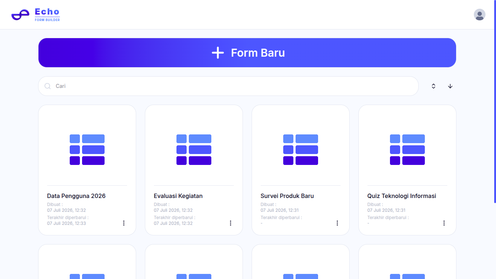
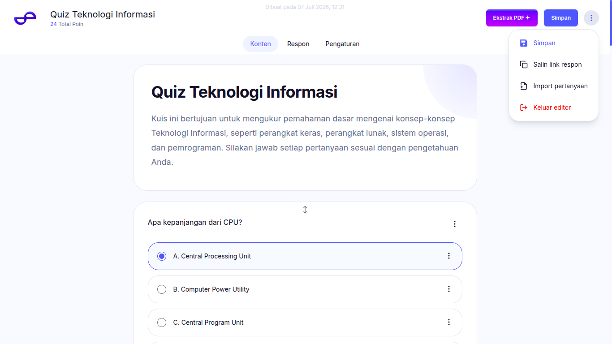
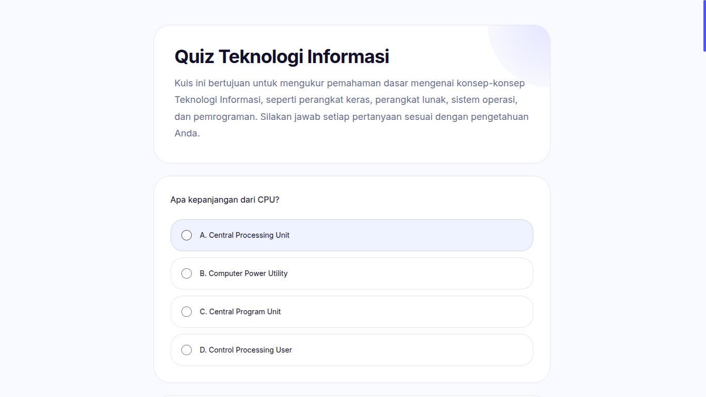
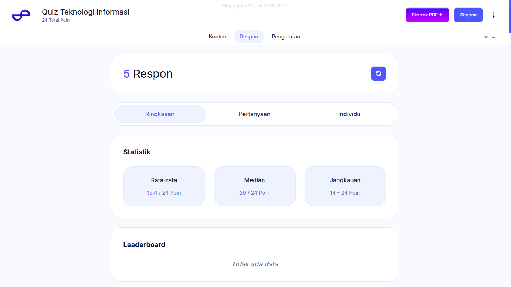
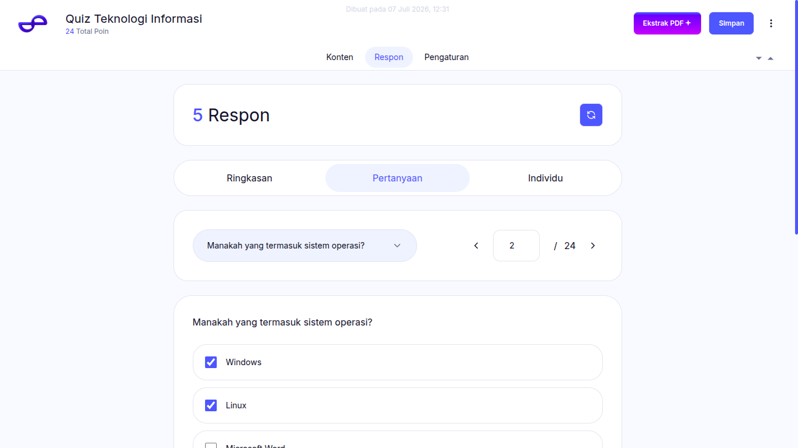
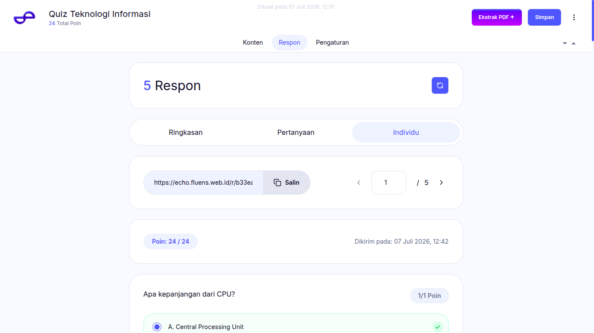
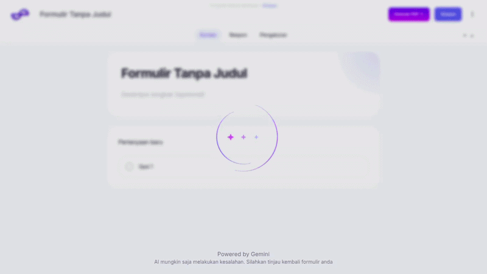

# Fluens Echo

> **A modern form builder powered by AI.**

Fluens Echo is a modern web-based form builder that enables users to create, share, and analyze online forms with ease. Inspired by Google Forms, Fluens Echo focuses on providing a clean user experience while introducing AI-powered capabilities to streamline form creation.

One of its flagship features is **PDF to Form Extraction**, allowing users to generate editable forms directly from PDF documents using AI.

---

## 🚀 Features

- ✅ User authentication
- ✅ Drag-and-drop form builder
- ✅ Multiple question types
- ✅ Share forms via public links
- ✅ Collect responses in real time
- ✅ Response analytics
- ✅ AI-powered PDF to Form Extraction

---

# 📸 Screenshots

## 🏠 Dashboard

```text
docs/screenshots/dashboard.png
```

<p align="center">
  
</p>

---

## 🛠️ Form Builder

```text
docs/screenshots/form-builder.png
```

<p align="center">
  
</p>

---

## 👀 Form Preview

```text
docs/screenshots/form-preview.png
```

<p align="center">
  
</p>

---

## 📊 Analytics

### Summary

```text
docs/screenshots/analytics-summary.png
```

<p align="center">
  
</p>

### Questions

```text
docs/screenshots/analytics-questions.png
```

<p align="center">
  
</p>

### Individual Responses

```text
docs/screenshots/analytics-individual.png
```

<p align="center">
  
</p>

---

## ✨ PDF → Form Extraction

```text
docs/gifs/pdf-to-form-extraction.gif
```

<p align="center">
  
</p>

---

# 🏗️ Tech Stack

| Category | Technology |
| :-------- | :--------- |
| **Frontend** |  Next.js +  React |
| **Backend** |  Next.js |
| **Database** |  Supabase |
| **Authentication** |  Supabase Auth |
| **Image Storage** |  Cloudinary |
| **AI** |  Google Gemini API |
| **PDF Parsing** | 📄 unpdf |
| **Deployment** |  Vercel |

---

# 🚀 Getting Started

## 1️⃣ Clone the repository

```bash
git clone https://github.com/jst-san/Fluens-Echo.git
cd Fluens-Echo
```

---

## 2️⃣ Install dependencies

```bash
npm install
```

---

## 3️⃣ Configure environment variables

Create a `.env.local` file and add the following variables:

```env
NEXT_PUBLIC_SUPABASE_URL=

NEXT_PUBLIC_SUPABASE_PUBLISHABLE_KEY=

SUPABASE_SECRET_KEY=

GOOGLE_AI_API_KEY=

NEXT_PUBLIC_CLOUDINARY_CLOUD_NAME=

NEXT_PUBLIC_CLOUDINARY_API_KEY=

CLOUDINARY_API_SECRET=
```

---

## 4️⃣ Start the development server

```bash
npm run dev
```

Open your browser and visit:

```text
http://localhost:3000
```

---

# 📂 Project Structure

```text
Fluens-Echo
├── app/
├── docs/
├── helpers/
├── lib/
├── public/
├── stores/
├── types/
├── utils/
├── package.json
├── proxy.ts
├── README.md
```

---

# 🤝 Contributing

Contributions are welcome.

If you'd like to contribute:

1. Fork this repository.
2. Create a new feature branch.
3. Commit your changes.
4. Open a Pull Request.

Please ensure your code follows the project's coding conventions and includes appropriate documentation where necessary.

---

# 📄 License

This project is licensed under the MIT License.

See the `LICENSE` file for more information.